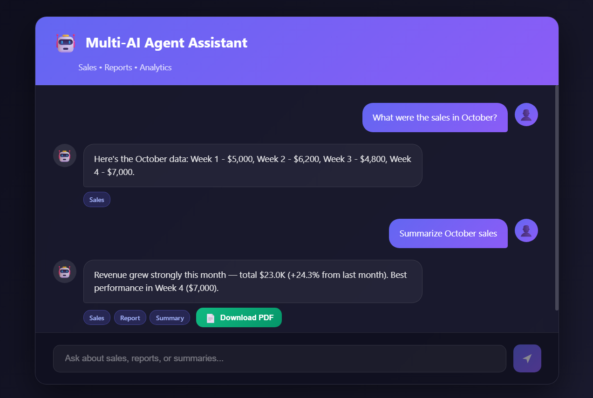

# Multi-AI Agent Chatbot

A full-stack application featuring a Node.js Express backend with intelligent AI agents (Sales, Report, Summary) and a React frontend with a beautiful dark-themed chat interface.

  

## 📋 Table of Contents

- [Overview](#-overview)
- [Features](#-features)
- [Tech Stack](#-tech-stack)
- [Project Structure](#-project-structure)
- [Prerequisites](#-prerequisites)
- [Installation](#-installation)
- [Running the Application](#-running-the-application)
- [API Endpoints](#-api-endpoints)
- [Screenshots](#-screenshots)

## 🎯 Overview

This project implements a multi-AI agent system where three specialized agents collaborate to process sales-related queries:

- **Sales Agent**: Fetches raw revenue data
- **Report Agent**: Creates structured analytics reports
- **Summary Agent**: Generates concise, user-friendly summaries

The system intelligently routes queries based on intent and provides optional PDF downloads for reports and summaries.

## ✨ Features

### Backend

- 🤖 **Intelligent Query Routing** - Automatically detects user intent (sales/report/summary)
- 📊 **Multi-Agent Collaboration** - Three specialized agents work together
- 📄 **PDF Generation** - Download professional reports (for report and summary queries)
- 🔄 **RESTful API** - Clean JSON responses with full execution details
- 📈 **Sample Data** - Pre-loaded sales data for September, October, November

### Frontend

- 🎨 **Modern Dark Theme** - Beautiful gradient UI like ChatGPT/Gemini
- 💬 **Real-time Chat Interface** - Smooth message flow with typing indicators
- 📱 **Responsive Design** - Works on desktop and mobile
- 🏷️ **Agent Badges** - Visual indicators showing which agents processed each query
- ⬇️ **Conditional PDF Downloads** - Download button appears only when PDF is available
- 🔄 **Session-based Chat** - Conversation persists until page refresh

## 🛠️ Tech Stack

### Frontend

- **React** (v19) - UI Library
- **Vite** - Build tool
- **Axios** - HTTP Client
- **CSS Modules** - Styling

### Backend

- **Node.js** - Runtime environment
- **Express** - Web framework
- **PDFKit** - PDF generation
- **Cors** - Cross-Origin Resource Sharing
- **Body-Parser** - Request parsing

## 📂 Project Structure

```
antigravity-practice/
├── backend/                # Node.js Express Backend
│   ├── agents/             # AI Agent logic (Sales, Report, Summary)
│   ├── managers/           # Agent orchestration
│   ├── routes/             # API routes
│   ├── utils/              # Helper functions
│   └── server.js           # Entry point
├── frontend/               # React Frontend
│   ├── src/                # Source code
│   ├── public/             # Static assets
│   └── vite.config.js      # Vite configuration
├── assets/                 # Project screenshots and assets
└── README.md               # Project documentation
```

## 🛠️ Prerequisites

Before you begin, ensure you have the following installed:

- **Node.js** (v14 or higher) - [Download](https://nodejs.org/)
- **npm** (comes with Node.js)

## 📥 Installation

1. **Clone the repository**

   ```bash
   git clone https://github.com/abhich21/Multi-AI-Agent-Assistant.git
   cd Multi-AI-Agent-Assistant
   ```

2. **Install Backend Dependencies**

   ```bash
   cd backend
   npm install
   ```

3. **Install Frontend Dependencies**
   ```bash
   cd ../frontend
   npm install
   ```

## 🚀 Running the Application

You need to run both the backend and frontend servers.

1. **Start the Backend** (runs on port 3000)

   ```bash
   cd backend
   npm start
   # or for development
   npm run dev
   ```

2. **Start the Frontend** (runs on port 5173)
   ```bash
   cd frontend
   npm run dev
   ```

Open [http://localhost:5173](http://localhost:5173) to view the application.

## 🔌 API Endpoints

### Chat Endpoint

**POST** `/api/chat`

Process a user query through the multi-agent system.

**Request Body:**

```json
{
  "query": "Give me a summary of sales for October"
}
```

**Response:**

```json
{
  "response": "In October, the total revenue was $15,000...",
  "data": { ... },
  "agent": "SummaryAgent",
  "pdfAvailable": true,
  "pdfUrl": "/reports/summary-123456.pdf"
}
```

## 📸 Screenshots



